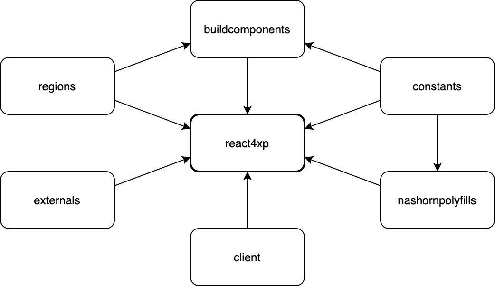

# react4xp-npm

[React4xp](https://developer.enonic.com/templates/react4xp) monorepo for all the NPM dependency packages required by both [lib-react4xp](https://github.com/enonic/lib-react4xp/) and parent projects running react4xp (for example the [react4xp starter](https://market.enonic.com/vendors/enonic/react4xp-starter) and anything derived from it).

These packages (with this project's package names in _italics_) are:

- [react4xp-buildconstants](https://www.npmjs.com/package/react4xp-buildconstants) (_constants_)
- [react4xp-build-components](https://www.npmjs.com/package/react4xp-build-components) (_buildcomponents_)
- [react4xp-regions](https://www.npmjs.com/package/react4xp-regions) (_regions_)
- [react4xp-runtime-client](https://www.npmjs.com/package/react4xp-runtime-client) (_client_)
- [react4xp-runtime-externals](https://www.npmjs.com/package/react4xp-runtime-externals) (_externals_)
- [react4xp-runtime-nashornpolyfills](https://www.npmjs.com/package/react4xp-runtime-nashornpolyfills) (_nashornpolyfills_)

These packages don't need separate installation, they are bundled as dependencies of the main [react4xp package](https://www.npmjs.com/package/react4xp) (_react4xp_).

  

## Usage

**Not intended for standalone installation or use.** See the docs of each unique package, in the links above.

  

## Development

You'll need Gradle 5+ (a 6.2.1 gradle wrapper is included), Java JDK 11, Enonic XP 7+, and Node.

### Internal package dependencies

All the sub-packages mentioned above are dependencies of this main react4xp package. In addition, _react4xp-regions_ and _react4xp-buildconstants_ are dependencies of _react4xp-build-components_, and  _react4xp-buildconstants_ is a dependency of _react4xp-runtime-nashornpolyfills_:

### Important: git

When committing to git, please follow the [conventional commits](https://www.conventionalcommits.org/en/v1.0.0-beta.2/) pattern in your messages, at least use `feat:` and `BREAKING CHANGE`. Also leave tags and all versioning to [lerna](https://github.com/lerna/lerna) with the _version_ NPM script (see below) - which depends on using git this way.

### Terminal commands

From the project root, handles the entire file structure: triggers the same tasks in subprojects under /packages/, where needed.

  - `npm run setup`: initial install, run this first.

  - `gradlew build`: main build command

  - `gradlew test`: main test command

  - `gradlew npmInstall`: install NPM dependencies. Note: in linked mode (see `npmLink` below), NPM links will be preserved (by this command and the build commands).

  - `gradlew cleanNpm`: delete node_modules/ folders in all packages. Cancels the linked mode (see `npmLink` below).

  - `gradlew clean`: delete build/ folders in all packages

  - `gradlew npmLink`: enter development linked mode: same as running [npm link](https://docs.npmjs.com/cli/link.html) in each package, but also linking up the internal dependencies between the packages. Use the cleanNpm gradle task (above) to exit linked mode. A corresponding script, `getlinks.sh`, can be run by relative path from a parent project's root folder (e.g. `sh ../../react4xp-npm/getlinks.sh`) to hook up the same links below that project's node_modules/. Sorry, no windows script yet (but it should be easy to reverse-engineer).

  - `gradlew versionAndPublish [ -Pdry ] [ -Pmessage='...' ]`: Auto-versions all changed packages, and publishes to NPM, after updating internal cross-dependency references. After committing your changes, run this to let [lerna](https://github.com/lerna/lerna) handle independent versioning in the packages, by tracking changes across them (use **[conventional-commit](https://www.conventionalcommits.org/en/v1.0.0/) flags** from your commit messages to track major:minor:patch versions), tagging the commit and auto-updating version tags everywhere. IMPORTANT: before running `version`, you should have run the `test` task. And after `versionAndPublish`, verify that the react4xp-* references in all packages/*/package-lock.json files are up-to-date (i.e. don't still refer to the previous versions for their dependencies). Further description in comments in [versionAndPublish.gradle](https://github.com/enonic/react4xp-npm/blob/master/versionAndPublish.gradle). Optional parameters:
    - `-Pdry`: dry-run
    - `-Pmessage='...'`: Common description of the entire release for all changed packages, will be used in commit messages to clarify and group the multiple commits that will occur during the process.

